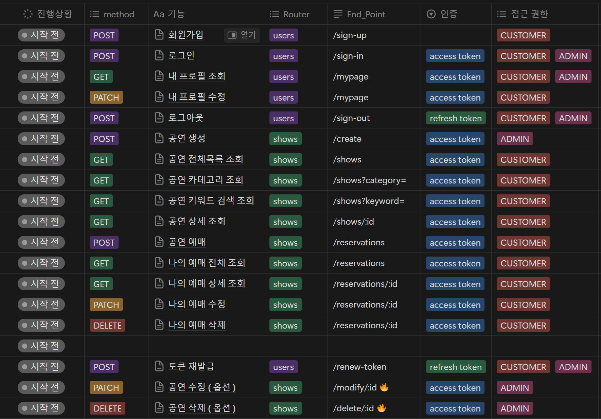
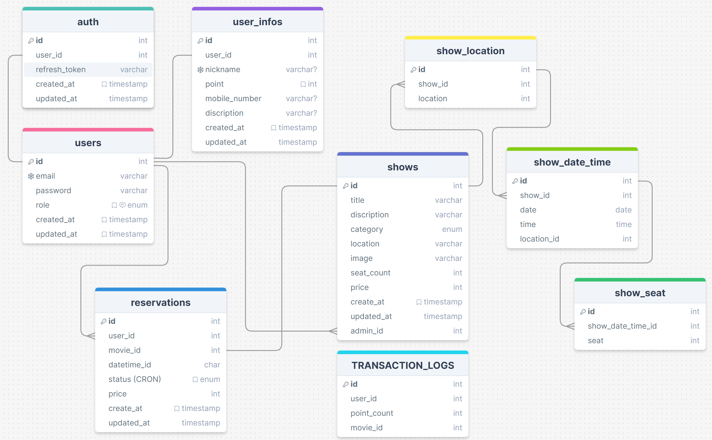

# ❓ 이 프로젝트는 ?

인터파크와 같은 공연예매 서비스를 퍼블리싱 합니다.
네이밍은 현재 진행하고 있는 스파르타코딩 클럽의 이름을 따서 Sparta_Park 로 지정하였습니다.

# 🚩 이 프로젝트의 목표는 ?

사용자가 원하는 공연을 예매할 수 있는 웹 사이트를 구현.<br/>
각 공연은 공연명, 공연시간, 장소, 가격 등의 정보를 가지고 있어야 하고, 사용자는 이를 통해 원하는 공연을 선택하고 예매할 수 있음!

# 📝 필수 기능 구현 리스트

- [x] 로그인 / 회원가입
- [ ] 프로필 보기
- [x] 새 공연 등록
- [x] 공연 목록 보기
- [ ] 공연 제목 검색하기
- [ ] 공연 지역 검색하기
- [ ] 공연 장르 검색하기
- [ ] 공연 상세보기
- [ ] 좌석을 지정하지 않고 공연 예매하기
- [ ] 예매 확인하기

# 🌐 이 사이트 접속하기

http://ginger-shop.duckdns.org/

# 👑 이 프로젝트에 사용된 기술은 ?

### Programming Languages & Frameworks


### Editor & Tester

  


### Infrastructure / Add-On / Database


<p align="center">
  <a href="http://nestjs.com/" target="blank"></a>
</p>

[circleci-image]: https://img.shields.io/circleci/build/github/nestjs/nest/master?token=abc123def456
[circleci-url]: https://circleci.com/gh/nestjs/nest

  <p align="center">A progressive <a href="http://nodejs.org" target="_blank">Node.js</a> framework for building efficient and scalable server-side applications.</p>
    <p align="center">
<a href="https://www.npmjs.com/~nestjscore" target="_blank"></a>
<a href="https://www.npmjs.com/~nestjscore" target="_blank"></a>
<a href="https://www.npmjs.com/~nestjscore" target="_blank"></a>
<a href="https://circleci.com/gh/nestjs/nest" target="_blank"></a>
<a href="https://coveralls.io/github/nestjs/nest?branch=master" target="_blank"></a>
<a href="https://discord.gg/G7Qnnhy" target="_blank"></a>
<a href="https://opencollective.com/nest#backer" target="_blank"></a>
<a href="https://opencollective.com/nest#sponsor" target="_blank"></a>
  <a href="https://paypal.me/kamilmysliwiec" target="_blank"></a>
    <a href="https://opencollective.com/nest#sponsor"  target="_blank"></a>
  <a href="https://twitter.com/nestframework" target="_blank"></a>
</p>
  <!--[](https://opencollective.com/nest#backer)
  [](https://opencollective.com/nest#sponsor)-->

## Description

[Nest](https://github.com/nestjs/nest) framework TypeScript starter repository.

## Installation

```bash
$ yarn install
```

## Running the app

```bash
# development
$ yarn run start

# watch mode
$ yarn run start:dev

# production mode
$ yarn run start:prod
```

## Test

```bash
# unit tests
$ yarn run test

# e2e tests
$ yarn run test:e2e

# test coverage
$ yarn run test:cov
```

  

  
