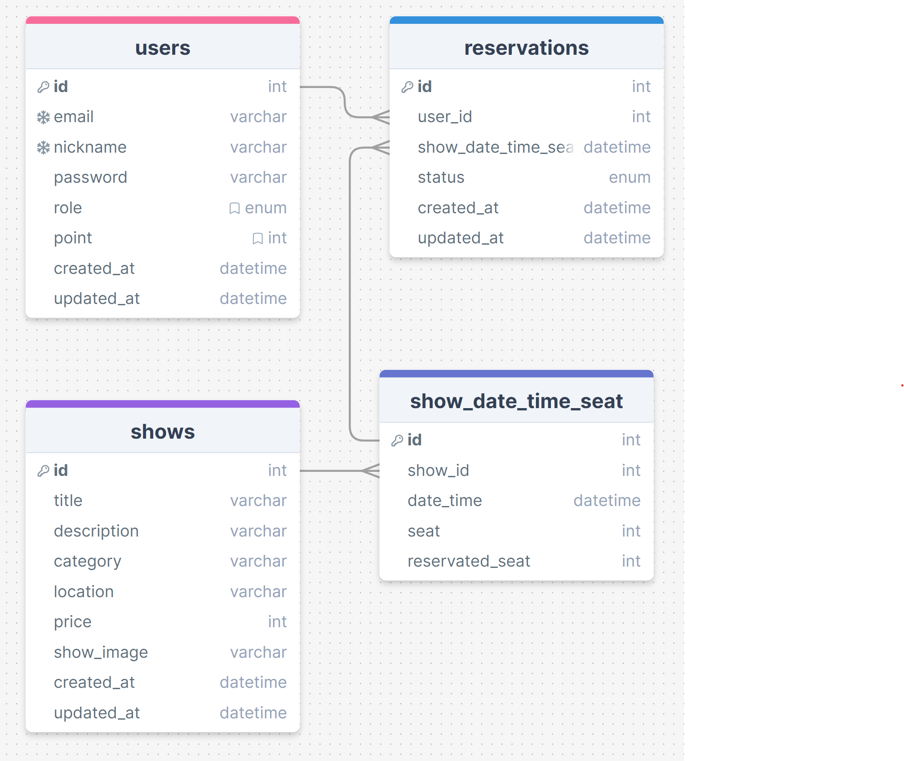

# ❓ 이 프로젝트는

인터파크와 같은 공연예매 서비스를 퍼블리싱 합니다.
네이밍은 현재 진행하고 있는 스파르타코딩 클럽의 이름을 따서 Sparta_Park 로 지정하였습니다.

# 🚩 이 프로젝트의 목표는

사용자가 원하는 공연을 예매할 수 있는 웹 사이트를 구현.<br/>
각 공연은 공연명, 공연시간, 장소, 가격 등의 정보를 가지고 있어야 하고, 사용자는 이를 통해 원하는 공연을 선택하고 예매할 수 있음!

# 📝 필수 기능 구현 리스트

- [x] 회원 가입
- [x] 회원 로그인
- [x] 나의 프로필 보기
- [x] 나의 프로필 수정
- [x] 새 공연 등록
- [x] 공연 전체 목록 보기
- [x] 공연 수정 하기
- [x] 공연 삭제 하기
- [x] 공연 제목 검색하기
- [x] 공연 지역 검색하기
- [x] 공연 장르 검색하기
- [x] 공연 상세보기
- [ ] 좌석을 지정하지 않고 공연 예매하기
- [ ] 예매 확인하기

# 📁 Insomnia REST IMPORT FILE 다운로드

https://drive.google.com/file/d/1feU828iQPAt39Nk-V4SD9OHy1gh47woV/view?usp=sharing

# 🌐 이 사이트 접속하기

http://ginger-shop.duckdns.org/

# ERD & API

### ⬇️ 최초 구상한 ERD

https://drawsql.app/teams/jsk-team/diagrams/sparta-park <br/>
 <br/>

### ⬇️ 최종 수정한 ERD

https://drawsql.app/teams/jsk-team/diagrams/sparta-showpark <br/>
 <br/>

### ⬇️ API 명세서

 <br/>

# 👑 이 프로젝트에 사용된 기술은 ?

### Programming Languages & Frameworks


### Editor & Tester

  


### Infrastructure / Add-On / Database


[circleci-image]: https://img.shields.io/circleci/build/github/nestjs/nest/master?token=abc123def456
[circleci-url]: https://circleci.com/gh/nestjs/nest

## ℹ️ Installation

```bash
$ yarn install
```

## ℹ️ Running the app

```bash
# development
$ yarn run start

# watch mode
$ yarn run start:dev

# production mode
$ yarn run start:prod
```
